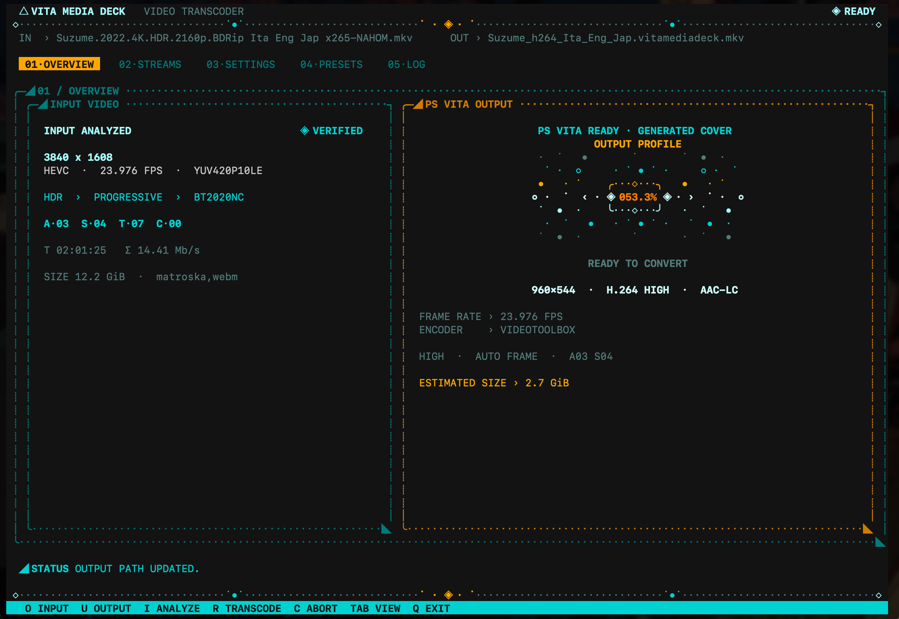
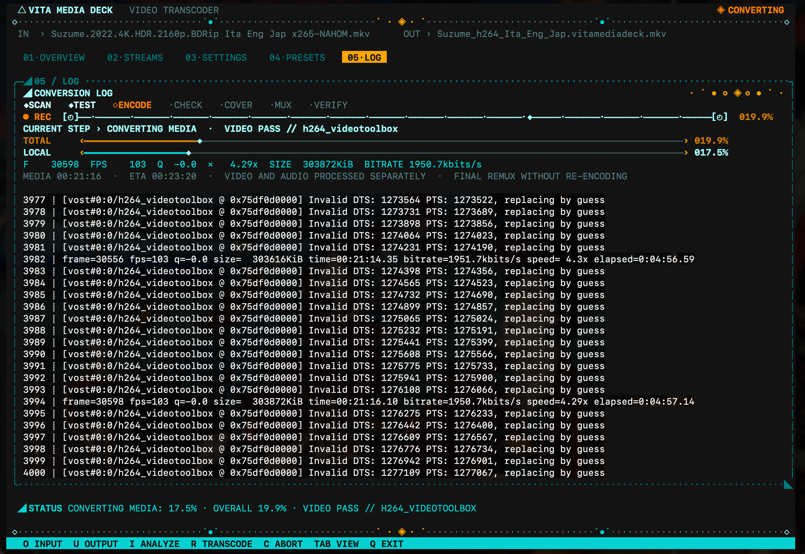

# VitaMediaDeck Transcoder

Standalone Python utility that converts videos on macOS, Windows, and Linux
into files optimised for VitaMediaDeck on PlayStation Vita. It is an external
host tool: it is not included in the VPK.





## What it produces

FFmpeg-compatible input files are converted to a seekable Matroska file with:

- H.264 High Profile, Level 3.1 up to 30 fps or Level 3.2 above 30 fps;
- a 960×544 PS Vita canvas with preserved aspect ratio and padding if needed;
- 8-bit BT.709 `yuv420p` video at the source frame rate, up to 60 fps;
- selected audio tracks as AAC-LC stereo, 48 kHz;
- selected subtitle tracks, chapters, language/title metadata, and compatible
  Matroska font attachments;
- an embedded 480×272 `cover.jpg`, using existing artwork first and a video
  frame only as fallback.

Matroska is deliberate: unlike MP4, it can retain formats such as ASS, PGS,
VobSub, and subtitle-font attachments. VitaMediaDeck demuxes H.264/AAC from
Matroska through either playback backend.

## Requirements

- Python 3.9 or newer;
- `ffmpeg` and `ffprobe` on `PATH`;
- current graphics drivers for hardware encoding.

The automatic encoder order is VideoToolbox on macOS, NVENC on NVIDIA,
AMF on AMD, VAAPI on Linux AMD/Intel, then `libx264` as the reliable fallback.
The tool runs a short frame-counted preflight and tries the next safe path if
an encoder cannot produce valid frames.

For 4K HDR input, FFmpeg must provide `zscale` and `tonemap`:

```sh
ffmpeg -hide_banner -filters | grep -E 'zscale|tonemap'
```

On macOS, Homebrew's `ffmpeg-full` is detected automatically when installed.

```sh
brew install ffmpeg-full
```

## Quick start

Convert a video with the recommended Vita profile:

```sh
python3 vitamediadeck_transcoder.py input.mkv
```

Choose an output path, inspect the planned FFmpeg command, or select an
encoder explicitly:

```sh
python3 vitamediadeck_transcoder.py input.mp4 output.vitamediadeck.mkv
python3 vitamediadeck_transcoder.py input.mov --dry-run
python3 vitamediadeck_transcoder.py input.mkv --encoder x264
```

Launch the terminal interface:

```sh
python3 vitamediadeck_tui.py
```

Or start it with a video and a preset:

```sh
python3 vitamediadeck_tui.py input.mkv output.vitamediadeck.mkv
python3 vitamediadeck_tui.py input.mkv --preset "Balanced"
```

On Windows only, install the `curses` compatibility package once:

```powershell
py -m pip install -r requirements-tui.txt
py vitamediadeck_tui.py
```

## Terminal interface

The TUI includes a file browser, input/output inspection, encoder and quality
settings, editable presets, per-track audio/subtitle selection, live FFmpeg
logs, progress, speed, bitrate, ETA, cancellation, and final validation.

| Key | Action |
| --- | --- |
| `O` / `U` | Select input / edit output path |
| `I` / `R` / `C` | Analyze / start / cancel conversion |
| `Tab`, `Shift+Tab`, `1`–`5` | Change page |
| Arrow keys, `Space` | Navigate and toggle a selected stream |
| `A`, `S`, `X` | Select all audio, all subtitles, or clear a stream type |
| `N`, `D` | Save or delete a custom preset |
| `Q` | Quit |

## Quality, HDR, and system load

The default **Vita Perceptual Max** profile targets approximately 2.4 Mb/s at
24 fps, 2.8 Mb/s at 30 fps, and 5.6 Mb/s at 60 fps. Use `--quality balanced`
or `--quality compact` when smaller files matter more.

Long conversions default to `--system-load balanced`: two CPU cores remain
available, heavy filters are capped, and macOS uses Utility QoS. Use
`--system-load low` for a lighter desktop impact, or `--system-load full` when
the computer is dedicated to conversion.

HDR sources are tone-mapped to 8-bit BT.709 SDR before H.264 encoding. The
tool stops if the required filters are missing rather than creating a visibly
incorrect file. Use `--force-hdr` for untagged HDR content.

## Tracks and covers

All audio and subtitle tracks are selected by default. In the TUI, select the
tracks on the **Streams** page; the CLI also accepts repeatable zero-based
`--audio-track` and `--subtitle-track` options. `--no-audio` and
`--no-subtitles` omit an entire stream type.

Cover priority is: `--cover-image`, embedded input artwork, then an extracted
SDR video frame. Disable it with `--no-cover`.

The converter encodes video and audio separately, repairs timestamps, aligns
audio to the final video duration, then remuxes the selected streams. It
validates duration and stream contracts before publishing the output.

## Related repositories

| Repository | Purpose |
| --- | --- |
| [`VitaMediaDeck`](https://github.com/spyro-98/VitaMediaDeck) | PS Vita media browser and player |
| [`vita-hw-decoder`](https://github.com/spyro-98/vita-hw-decoder) | Hardware H.264/AAC playback backend |
| [`vita-sw-decoder`](https://github.com/spyro-98/vita-sw-decoder) | CPU playback fallback |
| [`vita-https`](https://github.com/spyro-98/vita-https) | HTTPS and seekable remote transport |

Run `python3 vitamediadeck_transcoder.py --help` for every CLI option.
